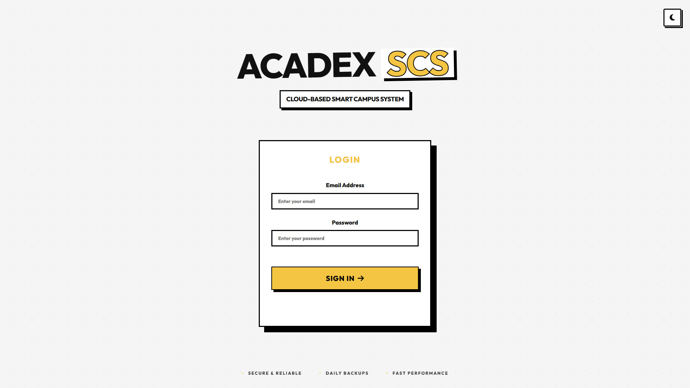
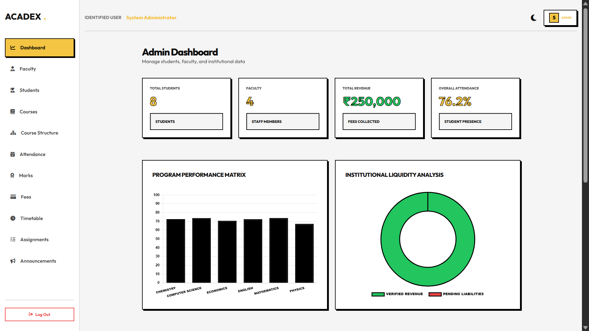
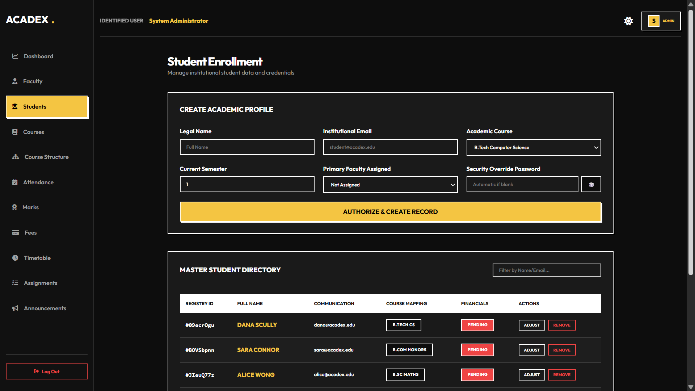

# Acadex - Cloud-Based Smart Campus System

AcaDex is developed using Google Cloud Platform (GCP) and Flask. The system allows users to enter student details through a web interface, which communicates securely with a backend API deployed on Cloud Run. The data is validated and stored in Cloud Firestore. The frontend is hosted on Cloud Run, ensuring public accessibility, while the backend and database remain secure. This cloud-native architecture ensures better scalability, security, and cost efficiency.

---

## Screenshots

### Login Interface
<p align="center">
  
</p>

---

### Admin Dashboard
<p align="center">
  
</p>

---

### Student Management Module
<p align="center">
  
</p>

## Project Structure

```text
Acadex/
|-- backend/
|   |-- app/
|   |   |-- middleware/
|   |   |-- routes/
|   |   |-- services/
|   |   `-- __init__.py
|   |-- main.py
|   |-- Dockerfile
|   `-- requirements.txt
|-- frontend/
|   |-- dashboards/
|   |-- css/
|   |-- js/
|   `-- index.html
`-- README.md
```

## Firebase Setup

1. Create a Firebase project.
2. Enable Email/Password authentication.
3. Create a Firestore database.
4. For local development only, you can place a Firebase Admin key at `backend/serviceAccountKey.json`.
5. Update the frontend Firebase web config in `frontend/js/auth.js` if you switch projects.

## Cloud Run Deployment

This repository can now be deployed as a single Cloud Run service. The container serves:

- the frontend at `/`
- the backend API at `/api/*`

### Prerequisites

1. Install the Google Cloud SDK.
2. Authenticate:
   ```bash
   gcloud auth login
   ```
3. Select your project:
   ```bash
   gcloud config set project YOUR_PROJECT_ID
   ```
4. Enable required services:
   ```bash
   gcloud services enable run.googleapis.com cloudbuild.googleapis.com artifactregistry.googleapis.com
   ```

### Build the container

Run this from the repository root:

```bash
gcloud builds submit --tag gcr.io/YOUR_PROJECT_ID/acadex
```

### Deploy to Cloud Run

```bash
gcloud run deploy acadex \
  --image gcr.io/YOUR_PROJECT_ID/acadex \
  --platform managed \
  --region us-central1 \
  --allow-unauthenticated \
  --port 8080 \
  --set-env-vars FIREBASE_PROJECT_ID=YOUR_PROJECT_ID
```

PowerShell users can run the same command with backticks instead of carets:

```powershell
gcloud run deploy acadex `
  --image gcr.io/YOUR_PROJECT_ID/acadex `
  --platform managed `
  --region us-central1 `
  --allow-unauthenticated `
  --port 8080 `
  --set-env-vars FIREBASE_PROJECT_ID=YOUR_PROJECT_ID
```

### Credentials on Cloud Run

Recommended production setup:

1. Do not bake `backend/serviceAccountKey.json` into the image.
2. Attach a Google service account to the Cloud Run service.
3. Give that service account Firestore access.
4. Set `FIREBASE_PROJECT_ID` during deploy.

The backend already falls back to Application Default Credentials on Cloud Run, so a JSON key file is not required there.

### Optional CORS Configuration

If you later host the frontend on a different origin, set:

```bash
CORS_ORIGINS=https://your-frontend.example.com
```

For the single-container Cloud Run setup, the frontend and API share one origin, so no frontend API URL changes are needed.

## Local Development

1. Backend only:
   ```bash
   cd backend
   pip install -r requirements.txt
   python main.py
   ```
2. Full app on one origin:
   - start the Flask app and open `http://localhost:8080/`
3. Static frontend only:
   - open `frontend/index.html` with Live Server
